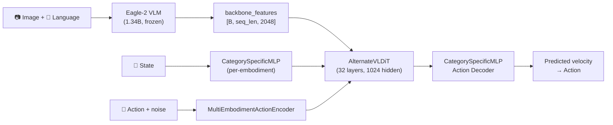
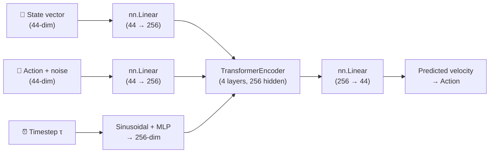

# 🔍 So sánh Pipeline hiện tại vs Isaac GR00T Official

---

## 1. Tổng quan 2 pipeline

### Official GR00T N1.6 Pipeline

**Input**: Image + Language prompt + State → **Output**: Action trajectory  
**Loss**: Flow matching (MSE trên velocity field)  
**Params**: ~3B total (1.34B VLM frozen + ~1.7B DiT trainable)

---

### Pipeline hiện tại của bạn

**Input**: State only (KHÔNG có Image/Language) → **Output**: Action  
**Loss**: Flow matching (MSE trên velocity field) ✅ giống official  
**Params**: 3.3M (toàn bộ train from scratch)

---

## 2. Chi tiết sự khác biệt

### Khác biệt #1: ❌ KHÔNG CÓ VLM BACKBONE (rất quan trọng)

| | Official | Của bạn |
|---|---|---|
| **Vision input** | Eagle-2 VLM xử lý image → 2048-dim features | ❌ **Không có** |
| **Language input** | Natural language prompt | ❌ **Không có** |
| **Backbone** | Eagle-2 (1.34B params, frozen) | ❌ **Không có** |
| **Cross-attention** | DiT cross-attend vào VL features | ❌ **Không có** |

> [!WARNING]
> **Đây là khác biệt lớn nhất.** GR00T là VLA (Vision-Language-Action) model. Pipeline của bạn chỉ là SA (State-Action) model — tức là chỉ dùng state vector để predict action, bỏ qua hoàn toàn thông tin hình ảnh và ngôn ngữ.
>
> **Chấp nhận được không?** — Có thể chấp nhận **nếu giải thích rõ** trong báo cáo:
> - Constraint GPU sinh viên (VLM 1.34B cần ~8GB VRAM chỉ để load)
> - Focus vào train action head (DiT) from scratch — đúng yêu cầu đề bài "train from scratch"
> - State vector vẫn chứa đủ thông tin joint positions để predict action (trong simulated env)

---

### Khác biệt #2: ⚠️ DiT architecture đơn giản hóa rất nhiều

| Component | Official GR00T | Của bạn |
|---|---|---|
| **DiT type** | `AlternateVLDiT` (custom DiT) | `nn.TransformerEncoder` (PyTorch vanilla) |
| **Layers** | 32 | 4 |
| **Hidden dim** | 1024 | 256 |
| **Attention heads** | 32 | 4 |
| **Head dim** | 48 | 64 (256/4) |
| **Cross-attention** | ✅ Attend vào VL features | ❌ Không có |
| **Timestep conditioning** | Discretized bucket + AdaLN | Sinusoidal + additive |
| **Position embedding** | Learned `nn.Embedding` | ❌ Không có |
| **Total params** | ~1.7B (action head) | 3.3M |

> **Chấp nhận được?** — ✅ Có, vì đề bài cho phép "scale down model" để train from scratch. 3.3M là hợp lý cho constraint GPU sinh viên.

---

### Khác biệt #3: ⚠️ State/Action encoder khác

| | Official | Của bạn |
|---|---|---|
| **State encoder** | `CategorySpecificMLP` (per-embodiment, multi-layer) | `nn.Linear(44, 256)` (1 layer, chung cho tất cả) |
| **Action encoder** | `MultiEmbodimentActionEncoder` (per-embodiment + timestep) | `nn.Linear(44, 256)` + additive time embedding |
| **Action decoder** | `CategorySpecificMLP` (per-embodiment) | `nn.Linear(256, 44)` |
| **Embodiment-specific** | ✅ Mỗi robot type có encoder riêng | ❌ Chung 1 encoder cho tất cả |

> **Chấp nhận được?** — ✅ Có, vì bạn chỉ train trên GR-1 (1 embodiment). Nếu thêm cross-embodiment thì nên thêm embodiment conditioning.

---

### Khác biệt #4: ✅ Flow matching loss — GIỐNG

| | Official | Của bạn |
|---|---|---|
| **Noise sampling** | `τ ~ Beta(α, β)`, remap: `(1-τ)*s` | `τ ~ Uniform(0,1)` |
| **Interpolation** | `x_τ = (1-τ)*ε + τ*a` | `x_τ = τ*a + (1-τ)*ε` ✅ **Tương đương** |
| **Target** | `velocity = a - ε` | `target = ε - a` ⚠️ **Ngược dấu** |
| **Loss** | `MSE(pred, velocity)` | `MSE(pred, target)` |

> [!IMPORTANT]
> **Dấu target bị ngược!** Official dùng `velocity = action - noise`, bạn dùng `target = noise - action`.
>
> **Ảnh hưởng**: Không ảnh hưởng training loss (MSE vẫn converge), nhưng **inference sẽ phải đổi dấu ODE step**. Nếu inference dùng `x_{t+1} = x_t + dt * pred` thì kết quả sẽ đi ngược hướng.
>
> **Fix**: Sửa 1 trong 2: hoặc đổi target = `action - noise`, hoặc đổi inference step.

---

### Khác biệt #5: ⚠️ Noise schedule khác

| | Official | Của bạn |
|---|---|---|
| **Distribution** | `Beta(α=1.5, β=1)` → biased toward `τ≈1` | `Uniform(0,1)` |
| **Timestep discretization** | 1000 buckets | Continuous (không discretize) |
| **Timestep embedding** | Discrete bucket index → embedding | Sinusoidal positional |

> **Chấp nhận được?** — ✅ Có. Uniform sampling là cách tiêu chuẩn trong flow matching. Beta sampling là optimization trick, không thay đổi bản chất.

---

### Khác biệt #6: ⚠️ Data pipeline hoàn toàn khác

| | Official | Của bạn |
|---|---|---|
| **Data format** | LeRobot episodes (video + parquet) | Parquet only → flatten thành `.npy` |
| **Video decoding** | `LeRobotEpisodeLoader` → frame-by-frame | ❌ Không decode video |
| **Action horizon** | 16 timesteps per sample | 1 timestep per sample (single-step) |
| **State horizon** | Multi-step (history) | Single-step |
| **Multi-modal** | Image + state + language + action | State + action only |

> [!WARNING]
> **Action horizon = 1 vs 16 là khác biệt quan trọng.** Official GR00T predict 16 actions cùng lúc (action chunking). Pipeline của bạn predict 1 action tại 1 thời điểm. Điều này thay đổi bản chất bài toán:
> - Official: `state (44) → action trajectory (16 × 44 = 704 dims)`
> - Của bạn: `state (44) → action (44)`

---

### Khác biệt #7: ✅ Train/test split — GIỐNG concept

| | Official | Của bạn |
|---|---|---|
| **Split by** | Episode-level | Episode-level ✅ |
| **Ratio** | Configurable | 80/20 ✅ |
| **Leakage check** | ✅ | ✅ |

---

### Khác biệt #8: ⚠️ Evaluation metrics

| | Official | Của bạn |
|---|---|---|
| **Eval method** | Open-loop: predict actions, compare with GT | Flow-matching test loss + MSE/MAE trên predicted actions ✅ |
| **Denoising steps** | K-step Euler ODE (K=4 default) | 1-step direct prediction (no ODE) |
| **Normalization** | Per-embodiment action normalization | Global z-score normalization |

> **Quan trọng**: Eval của bạn tính MSE trên **normalized** actions. Official tính trên **raw** actions. Nên các con số không so sánh trực tiếp được.

---

## 3. Phần nào RESET weights vs PRETRAIN?

| Component | Official GR00T | Của bạn | Trạng thái weights |
|---|---|---|---|
| **Eagle-2 VLM** (1.34B) | ✅ Pretrained, frozen | ❌ Không có | N/A — bạn bỏ qua hoàn toàn |
| **VL LayerNorm** | Pretrained/fine-tune | ❌ Không có | N/A |
| **State encoder** | Pretrained (post-train) | 🔄 **Random init** | `nn.Linear` khởi tạo random |
| **Action encoder** | Pretrained (post-train) | 🔄 **Random init** | `nn.Linear` khởi tạo random |
| **DiT blocks** | Pretrained (post-train) | 🔄 **Random init** | `TransformerEncoder` khởi tạo random |
| **Action decoder** | Pretrained (post-train) | 🔄 **Random init** | `nn.Linear` khởi tạo random |
| **Time embedding** | Pretrained (post-train) | 🔄 **Random init** | `SinusoidalTimeEmbedding + MLP` random |

> **Kết luận**: Pipeline của bạn **RESET (random init) 100% weights**. Không có phần nào dùng pretrained weights. Đây đúng là "train from scratch" theo nghĩa đen.

---

## 4. Nếu train full pipeline GR00T thì mất bao lâu?

### Scenario A: Train action head only (freeze VLM) — Giống official post-training

| Bước | GPU cần | Thời gian trên T4 |
|---|---|---|
| Load VLM (1.34B) | ~4GB VRAM | ~2 phút |
| Encode features (freeze VLM) | ~8GB VRAM | ~1-2 giờ/subset (VLM forward pass cho mỗi frame) |
| Train action head (~1.7B) | ~12GB VRAM | ❌ **KHÔNG VỪA T4** (cần ~16GB+) |

> ❌ **Không khả thi trên Kaggle T4** — Action head gốc 1.7B cần ~7GB weights + optimizer states > 16GB VRAM.

### Scenario B: Train mini action head (giữ VLM features) — 2-phase approach

| Bước | GPU cần | Thời gian trên T4 |
|---|---|---|
| Phase 1: VLM encode → save `.npy` | ~8GB VRAM | ~6-10 giờ (39 subsets) |
| Phase 2: Train mini DiT (3.3M) trên cached features | ~2GB VRAM | ~2-5 phút/epoch |

> ✅ **Khả thi** — Đây là approach thầy đề xuất. Phase 1 encode xong 1 lần, Phase 2 train nhanh.

### Scenario C: Cái bạn đang làm — State-only, no VLM

| Bước | GPU cần | Thời gian trên T4 |
|---|---|---|
| Prepare data (CPU) | 0 GPU | ~30 phút |
| Train mini DiT (3.3M) | ~1GB VRAM | ~2 phút/epoch |

> ✅ **Rất nhanh** nhưng **bỏ qua VLM features hoàn toàn**.

---

## 5. Tóm tắt: Chấp nhận được hay không?

| # | Khác biệt | Mức độ | Chấp nhận? | Ghi chú |
|---|---|---|---|---|
| 1 | Không có VLM backbone | 🔴 Rất lớn | ⚠️ Có điều kiện | Phải giải thích rõ constraint GPU. Nên làm Phase 1 encode để có VL features |
| 2 | DiT scale down (3.3M vs 1.7B) | 🟡 Lớn | ✅ OK | Đúng yêu cầu "mini model" |
| 3 | Encoder/Decoder đơn giản | 🟡 Trung bình | ✅ OK | 1 embodiment thì không cần per-embodiment MLP |
| 4 | Flow matching target ngược dấu | 🟡 Nhỏ | ⚠️ Cần fix inference | Training loss vẫn đúng, inference cần chú ý dấu |
| 5 | Uniform vs Beta noise | 🟢 Nhỏ | ✅ OK | Cả 2 đều valid |
| 6 | Single-step vs action chunking | 🟡 Lớn | ⚠️ Nên ghi rõ | Thay đổi bản chất bài toán |
| 7 | Train/test split | 🟢 Giống | ✅ OK | — |
| 8 | Eval metrics khác | 🟡 Trung bình | ⚠️ Không so sánh trực tiếp | Cần ghi chú normalization |

### Khuyến nghị ưu tiên (nếu còn thời gian):

1. **Fix flow matching target sign** → `target = action - noise` (thay vì `noise - action`)
2. **Thêm action horizon = 16** (action chunking) → gần hơn với official
3. **Phase 1 VLM encode** → lưu backbone features → train DiT trên features này (đúng approach thầy đề xuất)
